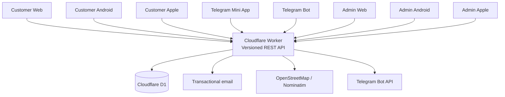

# CRM Delivery Platform

A production-deployed, multi-client commerce and order-management platform built around one canonical backend for customers, shops, products, carts, orders, fulfillment, locations, and identity.

The project combines a Cloudflare Worker API and D1 database with customer and administration experiences across Web, Android, Telegram, and Apple codebases. It is developed as a production system: business rules live on the server, schema changes are versioned, authentication boundaries are explicit, and important workflows are verified before deployment.

[Live customer shop](https://crm.ayartuerk.me/shop) · [Live admin](https://crm.ayartuerk.me/admin/) · [Telegram bot](https://t.me/SpecialDeliveryBerlinBot)

## Product at a glance

| Surface | Audience | Current state |
| --- | --- | --- |
| Customer Web | Shoppers | Live passwordless email registration and sign-in |
| Customer Android | Shoppers | Native catalog, cart, orders, canonical email identity, encrypted session persistence, and logout |
| Telegram Mini App | Shoppers | Telegram-authenticated canonical customer session and email linking |
| Telegram Bot | Shoppers and notifications | Operational; remaining legacy order paths are being migrated to the canonical V2 lifecycle |
| Admin Web | Shop operations and Superadmins | Live order, customer, catalog, settings, account, and audit workflows |
| Admin Android | Shop owners and staff | Broad operational parity, including lifecycle actions, catalog management, customer communication, recovery, and Superadmin tools |
| Apple clients | Customers and administrators | Shared native foundation present; parity work follows the Android implementation |

The backend is deployed publicly, while customer and shop-owner rollout remains controlled during development.

## Why this project is interesting

- One server-authoritative domain model supports several very different clients.
- Canonical identity connects email and Telegram entry routes without silently duplicating or merging accounts.
- Web sessions use scoped secure cookies and CSRF protection; native clients use gated bearer sessions stored with platform-protected encryption.
- A unified V2 order lifecycle supports delivery, pickup, additions, cancellations, terminal states, and safe recreation of cancelled orders.
- Multi-shop tenancy separates a person's identity from shop ownership and staff authorization.
- English, German, Turkish, Arabic, and Russian share generated localization contracts, including RTL-aware Arabic interfaces.
- D1 migrations, architecture decisions, API contracts, verification records, and deployment checks are kept in the repository.

## Architecture



The Cloudflare Worker is the source of truth. Clients present platform-appropriate interfaces but do not maintain independent pricing, identity, authorization, cart, order, or fulfillment rules.

## Core engineering decisions

### Canonical identity

Customers may begin through email or Telegram and later link another verified identity to the same canonical account. Browser, native, Mini App, and bot sessions resolve to shared account state while retaining transport-specific security controls.

Staff identity is distinct from tenant authorization. Superadmin authority belongs to the platform staff profile; shop access comes from explicit owner, manager, or staff membership.

See [ADR-0005](docs/decisions/ADR-0005-identity-email-and-account-recovery.md) and the [identity/D1 contract](docs/architecture/identity-email-recovery-d1-contract.md).

### Canonical shop tenancy

The schema is multi-shop from the foundation. A customer has one global identity, may shop across providers, and may later become a shop owner without receiving a second login. Controlled onboarding is supported now; self-service shop applications and Superadmin approval are part of the planned product flow.

See [ADR-0006](docs/decisions/ADR-0006-canonical-shop-tenancy.md) and the [multi-shop model](docs/architecture/MULTI_SHOP_MODEL.md).

### Unified order lifecycle

The V2 model centralizes carts, immutable commercial snapshots, order items, additions, status history, locations, and terminal-state behavior. Admin Web and Android consume the same transitions and validation rules.

See the [current lifecycle](docs/CURRENT/order-lifecycle-v2.md) and [ADR-0003](docs/decisions/ADR-0003-unified-order-lifecycle-v2.md).

## Representative workflows

### Customer

1. Browse products and categories.
2. Shop as a guest or authenticate through email or Telegram.
3. Add items to a canonical cart.
4. Select delivery or pickup and provide a validated location.
5. Submit an order and follow its lifecycle.
6. Keep the same customer identity across supported clients.

### Shop administration

- Process active, closed, cancelled, delivered, and not-delivered orders.
- Approve or reject additions and perform delivery/pickup transitions.
- Recreate cancelled orders without creating competing active successors.
- Manage products, categories, aliases, meeting points, delivery cities, and operational settings.
- Review customers, locations, conversations, requests, and audit history.

### Platform administration

- Manage administrative accounts and access state.
- Maintain Superadmin-only controls and audit visibility.
- Keep shop membership separate from global platform authority.
- Review future shop-owner applications before activation.

## Technology

| Area | Technologies |
| --- | --- |
| Backend | JavaScript, Cloudflare Workers, versioned REST APIs |
| Database | Cloudflare D1, SQLite-compatible SQL, ordered migrations |
| Web | Server-rendered responsive interfaces and TypeScript/Vite Mini App |
| Android | Kotlin, Jetpack Compose, Android Keystore-backed session storage |
| Apple | Swift, SwiftUI, shared native models |
| Integrations | Telegram Bot API, transactional email, OpenStreetMap/Nominatim |
| Quality | Node test runner, Gradle builds, contract checks, localization generation, smoke tests |

## Repository map

```text
cloudflare-worker/   Deployed API, Web surfaces, D1 migrations, and backend tests
android/             Customer Android app and shared Android API models
apps/admin-android/  Admin Android application
apple/               Customer/Admin Apple clients and shared Swift code
telegram/            Telegram Mini App and bot-facing client code
shared/i18n/         Cross-client localization source
docs/CURRENT/        Active implementation truth
docs/architecture/   Architecture and data-model documentation
docs/decisions/      Architecture Decision Records
docs/api-contract/   API and lifecycle contracts
docs/verification/   Focused implementation and validation evidence
```

Historical material is kept under `docs/archive/`; it is not the current implementation reference.

## Local validation

### Backend

```bash
npm --prefix cloudflare-worker test
npm --prefix cloudflare-worker run i18n:check
node --check cloudflare-worker/src/index.js
```

### Telegram Mini App

```bash
npm --prefix telegram/mini-app run build
```

### Customer Android

```bash
cd android
./gradlew :customer-app:compileDebugKotlin :customer-app:assembleDebug --no-daemon
```

### Admin Android

```bash
cd apps/admin-android
./gradlew :app:compileDebugKotlin :app:assembleDebug --no-daemon
```

Production deployment additionally requires the Cloudflare bindings and secrets documented by the Worker configuration and runbooks. Secrets, recovery material, and production credentials do not belong in the repository.

## Current development focus

Completed foundations include:

- canonical Telegram and email customer identities;
- Web and Android customer email registration/sign-in;
- authenticated Telegram Mini App sessions;
- encrypted native customer session persistence;
- staff enrollment and recovery foundations;
- canonical shop tenancy and future self-service onboarding schema;
- unified V2 customer/order/location APIs;
- extensive Admin Android operational workflows;
- five-locale shared administration text generation.

The next major slices are:

1. guest-to-authenticated cart/account convergence;
2. customer registration and session parity across remaining native clients;
3. controlled shop-owner onboarding and synchronized shop management;
4. completion of Admin Android release-quality navigation, accessibility, and UI tests;
5. Apple parity after Android workflows stabilize;
6. migration of the remaining Telegram bot paths to the canonical V2 lifecycle.

## Documentation

- [Development strategy](docs/CURRENT/development-strategy.md)
- [Current project structure](docs/CURRENT/project-structure.md)
- [Admin mobile roadmap](docs/mobile-admin/implementation-roadmap.md)
- [Website/mobile parity matrix](docs/mobile-admin/website-mobile-parity-matrix.md)
- [API contracts](docs/api-contract/README.md)
- [Project handoff](docs/project-handoff.md)

## Project approach

This is an actively developed portfolio project, built as though it were progressing toward a real production product. Changes are delivered in coherent slices: inspect the current behavior, update the smallest complete boundary, validate locally, deploy when appropriate, smoke-test the live workflow, and then commit the verified result.
